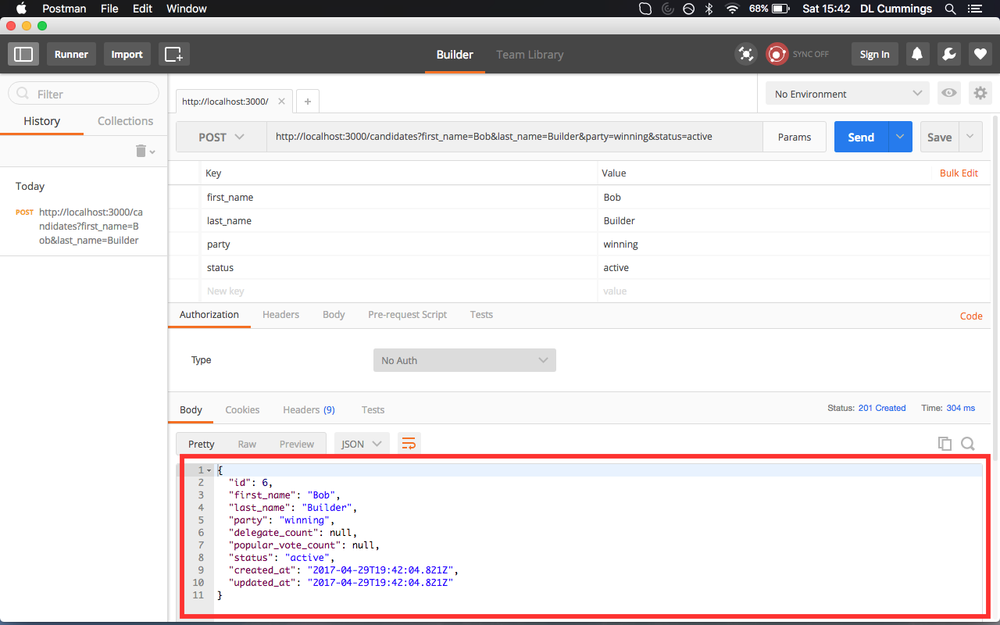

# Tutorial Instructions

## Table of Contents

[Step 1: Create A New Rails Project](#create-a-new-rails-project)

[Step 2: Initial Commit](#initial-commit)

[Step 3: Update your gemfile](#update-gemfile)

[Step 4: Generate rspec tests](#generate-rspec-tests)

[Step 5: Generate Candidate model ](#generate-candidate-model)

[Step 6: Create first test](#create-first-test)

[Step 7: Add FactoryGirl and Faker gems](#add-factorygirl-and-faker-gems)

[Step 8: Add a request spec](#add-a-request-spec)

[Step 9: Seed development database](#seed-development-database)

[Step 10: Check GET request in browser](#check-get-request-in-browser)

[Step 11: Send POST request through Postman](#send-post-request-through-postman)

[Step 12: Create POST request test ](#create-post-request-test)

[Step 13: Test POST request through Postman ](#test-post-request-through-postman)

[Resources and Further Reading](#resources-and-further-reading)

## Clone the bundled api project

In this directory you'll find the file _api.git_ which is the completed
project. Try not to use this unless you get stuck. If you do need it, do the
following: `$ git clone api.git election_api/`

You may wish to move _api.git_ into a new directory outside of this project.
_api.git_ is a bundle of the actual api repo, with all the commits. It may
cause you conflict cloning it here.

## Create your own api project, step-by-step

### Create a new rails project

`$ rails new election_api --api -T -d postgresql`

* _rails new_ initiates a new rails app, in this case called, "election_api."
* the `--api` flag tells rails to create an api-only applicaton
* the `-T` flag skips including the default test, minitest
* the `-d postgresql` flag tells rails to preconfigure the application with postgres database

### Initial commit 

```
cd election_api/

git init
git add --all
git commit -m "initial commit"
```

### Update gemfile

* rspec-rails
* shoulda-matchers
* database_cleaner 

run `bundle update` and commit your changes

### Generate rspec tests

`$ rails generate rspec:install`

### Generate Candidate model 

`$ rails g model Candidate first_name:string last_name:string party:string status:string`

* first name as type string
* last name as type string
* party as type string
* status as type string

create and migrate your database,

```
rake db:create
rails db:migrate
```

### Create first test

in `spec/models/candidate_spec.rb` add the following,

``` ruby
RSpec.describe Candidate, type: :model do
  it { should validate_presence_of(:first_name) }
  it { should validate_presence_of(:last_name) }
  it { should validate_presence_of(:party) }
  it { should validate_presence_of(:status) }
end
```

run `bundle exec rake rspec spec/` to see the test fail (we haven't written any code yet)

next make your tests pass by adding the following to `app/models/candidate.rb`,

``` ruby
class Candidate < ApplicationRecord
  validates_presence_of :first_name, :last_name, :party, :status
end
```

Run your test again, confirm it passes and commit your changes

### Add FactoryGirl and Faker gems

``` ruby
group :development, :test do
  gem 'factory_girl_rails', '~> 4.0'
  gem 'rspec-rails', '~> 3.5'
  gem 'byebug', platform: :mri
  gem 'faker'
end
```

run `bundle exec rspec spec/` and commit your changes

### Add a request spec

In `spec/factories/candidates.rb`, add a Candidate factory and use the Faker gem to generate fake data.

``` ruby
FactoryGirl.define do
  factory :candidate do
    first_name         { Faker::Name.first_name }
    last_name          { Faker::Name.last_name } 
    party              { Faker::Lorem.word }
    status             "active"
  end
end
```

Create your GET request test in, `spec/requests/candidates_spec.rb`,

``` ruby
require 'rails_helper'

describe Candidate do
  let!(:candidate) { FactoryGirl.create(:candidate) }

  it "returns a valid json response" do
    get "/candidates"
    expect(response.status).to eql(200)
    expect(response.content_type).to eq("application/json")
  end
end
```

Run `bundle exec rspec spec/` to see the test fail. Next, make the test past by
updating the routes and controller files,

`config/routes.rb`

``` ruby
Rails.application.routes.draw do
  resources :candidates
end
``` 

`app/controllers/candidates.rb`

``` ruby
class CandidatesController < ApplicationController
  def index
    @candidates = Candidate.all
    render json: @candidates
  end
end
```

### Seed development database

Add the following factory to, `db/seeds.rb`,

``` ruby
# create 5 candidates

5.times do
  Candidate.create(
    first_name:         Faker::Name.first_name,
    last_name:          Faker::Name.last_name,
    party:              Faker::Lorem.word,
    status:             "active"
  )
end
```

Run, `bundle exec rake db:seed` and commit changes.

### Check GET request in browser

HOORAY! Let's see some stuff!

Start the rails server with, `$ rails server` and navigate to, 
`http://localhost:3000/candidates` and you should expect to see something like,

``` json
[{"id":1,"first_name":"Sven","last_name":"Ebert","party":"facere","delegate_count":72,"popular_vote_count":8393,"status":"active","created_at":"2017-04-29T18:59:19.391Z","updated_at":"2017-04-29T18:59:19.391Z"},
{"id":2,"first_name":"Peter","last_name":"Keebler","party":"tempore","delegate_count":85,"popular_vote_count":3728,"status":"active","created_at":"2017-04-29T18:59:19.395Z","updated_at":"2017-04-29T18:59:19.395Z"},
{"id":3,"first_name":"Ericka","last_name":"Quigley","party":"quia","delegate_count":95,"popular_vote_count":5416,"status":"active","created_at":"2017-04-29T18:59:19.397Z","updated_at":"2017-04-29T18:59:19.397Z"},
{"id":4,"first_name":"Kallie","last_name":"Hermiston","party":"aut","delegate_count":92,"popular_vote_count":10030,"status":"active","created_at":"2017-04-29T18:59:19.398Z","updated_at":"2017-04-29T18:59:19.398Z"},
{"id":5,"first_name":"Marlon","last_name":"Kub","party":"pariatur","delegate_count":79,"popular_vote_count":1225,"status":"active","created_at":"2017-04-29T18:59:19.400Z","updated_at":"2017-04-29T18:59:19.400Z"}]
```

At this point, we've only used rspec tests to write our app. We'll add [Postman](https://www.getpostman.com/)
to our toolbelt to create our POST request (you may need to install it first).

### Send POST request through Postman

Open Postman and make a POST request to, `http://localhost:3000/candidates`
(ensure rails server is running).


Then expect to see the following error message:


### Create POST request test 

Add the following test to, `spec/requests/candidates_spec.rb`,

``` ruby
describe Candidate do
  let!(:candidate) { FactoryGirl.create(:candidate) }
  let(:new_candidate) do {
    first_name: "Tom",
    last_name:  "Thumb",
    party:      "mini",
    status:     "active"
  } end

  it "creates a new candidate entry" do
    post "/candidates", params: new_candidate

    post_response = JSON.parse(response.body)

    expect(response.status).to eql(201)
    expect(post_response["last_name"]).to eq("Thumb")
  end
end
```

As expected, running `bundle exec rake rspec spec/` to see your test fail.
Then update your candidates controller,

``` ruby
 def create
   candidate = Candidate.create(candidate_params) 
   if candidate.save
     render json: candidate, status: :created 
   else
     render json: { "error": "failed to create" }
   end
 end

 private

 def candidate_params
   params.permit(
     :first_name,
     :last_name,
     :party,
     :delegate_count,
     :popular_vote_count,
     :status
   )
 end
```

Run your (now passing) tests again and commit.

### Test POST request through Postman 

Click on the Params button to show the Key Value form and fill in as shown below
(feel free to replace the values on the right with your own values).


Click on Send to see the following response,



CONGRATULATIONS!! You have created your first Rails 5 API-only application!

## Resources and Further Reading

[What Is an API, and Why Does It Matter?](http://sproutsocial.com/insights/what-is-an-api/)

[Rails Guides: API-only](http://guides.rubyonrails.org/api_app.html) 

[Postman](https://www.getpostman.com/)

[Programmable Web](https://www.programmableweb.com)
